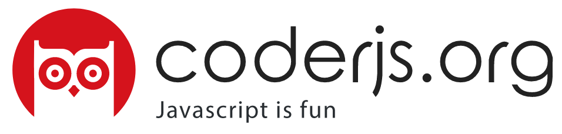

# Materi ProjectBasedLearning - CoderJS

> Kumpulan Materi Project Based Learning

---

## Last Updated

---

## Table of Contents

1. **[Perkenalan HTML & CSS](#html-&-css)**
2. **[Bootstrap](#bootstrap)**
3. **[Javascript Fundamental](#javascript-fundamental)**
4. **[Coming Soon](#coming-soon)**

---

## Any Question?

Jika kalian ingin bertanya seputar program ini atau ingin bergabung dengan CoderJS, silahkan bertanya digrup Telegram, untuk bergabung akses [link ini](http://bit.ly/coderjsorg)

---

### HTML & CSS

> * :computer: [Drop this subject](files/ProjectBasedLearning1.pdf)

### Bootstrap

> * :computer: [Drop this subject](files/ProjectBasedLearning2.pdf)

### Javascript Fundamental

> * :computer: [Drop this subject](files/ProjectBasedLearning3.pdf)

###  Coming Soon

> * :soon: [Drop this subject]()

**[⬆ back to top](#table-of-contents)**

